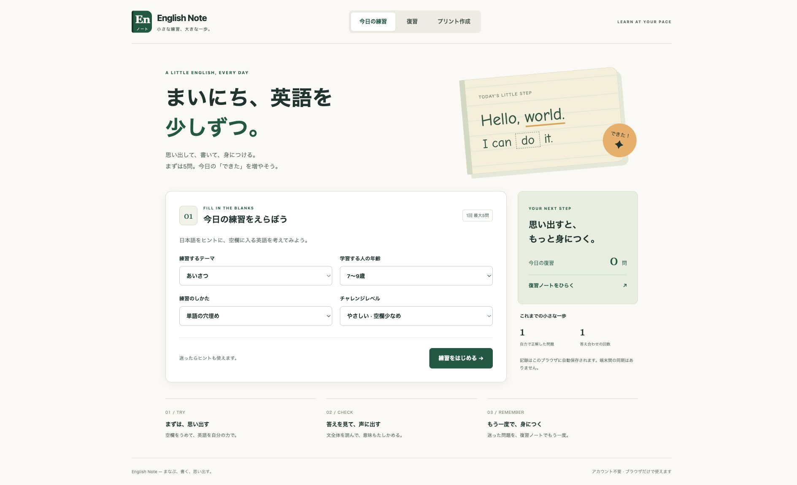

# English Note — 英語の練習と復習ノート

穴埋めを解く、答えを確かめる、日をあけて復習する。英語学習と4本線プリント作成をブラウザだけで行える静的Webアプリケーションです。アカウントやバックエンドは不要です。

## ライブデモとステータス

- ライブデモ: [https://knishioka.github.io/english-note-maker/](https://knishioka.github.io/english-note-maker/)
- 
- 



## 主な機能

### 今日の練習・復習

- テーマ・年齢・難易度を選び、最大5問ずつ単語／文字の穴埋めに挑戦
- 空欄ごとの入力、文字数・先頭文字のヒント、答え合わせと文全体のお手本
- 大文字・小文字、前後の空白、全角英字、曲がったアポストロフィの違いは許容。お手本と、教材ごとに確認・登録した別解で採点します。未登録の表現が英語として誤りとは限りません
- 間違い・ヒントを使った問題はすぐ復習。自力で正解するたびに1・3・7・14日後へ復習予定を延長
- 結果画面から迷った問題だけ再挑戦、または解いた問題を同じ順番・同じ空欄で印刷
- 最大20個の問題セットを保存。JSONファイルで書き出し・読み込みができ、問題を別端末でも再利用できます（学習記録は共有しません）
- 教材の固定IDで履歴を管理。日本語の修正時は空欄を保持し、英文の改訂時は空欄を作り直して履歴を引き継ぎます
- 学習記録はこのブラウザの localStorage に保存。端末間の同期はなく、ブラウザのデータ削除で消えます。記録は利用者別には分かれないため、共有端末ではブラウザのプロファイルを分けてください
- 入力途中の答えは再読み込みで消えます。画面内のナビゲーションでは保持します。保存が使えない環境でも、その画面を開いている間は練習・復習を続けられます

### 練習モード

1. **通常練習**: 基本的な罫線ノート（自由記述用）
2. **文章練習**: 年齢別の例文と練習行のセット
3. **単語練習**: カテゴリー別の単語と発音ガイド（音節表示付き）
4. **アルファベット練習**: 大文字・小文字の練習（2列レイアウト）
5. **フレーズ練習**: 実用的な会話表現と使用場面の表示
6. **穴埋め練習**: 単語／文字の空欄と解答欄。解答表示・用紙設定の変更でも出題順と空欄を維持
7. **フォニックス練習**: 音のパターンに集中した単語練習
8. **サイトワード練習**: 読む・なぞる・写す・思い出す練習

### 学習コンテンツ

- **単語カテゴリー（5種類）**: 動物、食べ物、色、数字、曜日・月
- **フレーズカテゴリー（21種類）**: あいさつ、自己紹介、学校生活、買い物、旅行・移動、感情表現、日常生活、教室での英語、友達作り、文化交流、緊急時の表現、数と算数、家族、趣味・遊び、食べ物・食事、天気、助けを求める、意見・好み、予定を立てる、謝る・感謝する、体・健康
- 教材の点検範囲・修正例・継続点検の基準は [教材レビュー](docs/content-review-2026-09.md)、問題の追加・再利用の仕組みは [学習機能の設計](docs/learning-studio.md) を参照してください

### 年齢別の設計

- **4〜6歳**: 基本的で視覚的な語彙、簡単なフレーズ
- **7〜9歳**: 日常的な学校生活語彙、実用的な表現
- **10〜12歳**: 学術的・抽象的な語彙、複雑な文章表現

### カスタマイズ

- 罫線の高さ: 8mm（小さめ）、10mm（標準）、12mm（大きめ）
- 罫線の色: グレー、青、緑
- 表示オプション: 日本語訳、使用場面、名前・日付欄
- ページ数: 1〜60ページ
- 共有URL: 現在の練習モードや印刷設定をURLに反映し、同じ設定を再読み込みや別端末で再現
- サイトワード練習: 4/6/8語を「読む・なぞる → 写す → 思い出す」の順で印刷練習

## インターナショナルスクール向けの工夫

### 実践的な内容

- 教室で実際に使う表現を厳選
- 文化交流や国際理解に役立つフレーズを収録
- 学習方法や問題解決のための表現を追加

### 段階的な学習設計

- 年齢に応じた語彙の難易度調整
- 基礎から応用まで体系的に学習可能
- 音節表示による発音練習サポート

### 4本線による正確な文字練習

- **上線**: 大文字の頂点（bやdの上部）
- **中線上**: 小文字の頂点（aやcの上部）
- **中線下**: ベースライン（文字の基準線）
- **下線**: 下降文字の底（gやyの下部）

## 使い方

### オンライン版

1. [デモサイト](https://knishioka.github.io/english-note-maker/)にアクセス
2. 「今日の練習」でテーマを選んで穴埋めを解く。「復習」からもう一度挑戦
3. 印刷する場合は「プリント作成」で練習モードとオプションを選択
4. 「印刷・PDF保存」ボタンをクリック

### 印刷の推奨設定

- 用紙サイズ: A4
- 印刷の向き: 縦
- 余白: なし（アプリ側で制御）
- 背景グラフィック: 有効（罫線表示に必要）

### 動的レイアウト調整

- 罫線の高さに応じてコンテンツ量を自動調整
- A4サイズに収まるよう最適化
- ページあふれを防止するバランス調整

## ローカル開発

```bash
# 依存関係のインストール
npm install

# 開発サーバー起動
npm run dev

# テスト実行
npm run test
```

## 技術的な特徴

- フロントエンド完結のSPAとして動作し、GitHub Pagesでホスティング
- 印刷時はCSSでA4向けに最適化し、オフライン利用も可能
- 自動レイアウト検証システムとCI/CDにより品質を担保

## プロジェクト構成

```
english-note-maker/
├── index.html           # メインページ
├── styles.css           # スタイルシート（印刷CSS含む）
├── script.js            # アプリケーションロジック
├── src/
│   └── quality-validator.js  # レイアウト品質検証
├── test/
│   ├── content-test.js  # コンテンツ整合性テスト
│   └── layout-test.js   # レイアウト妥当性テスト
├── .github/
│   └── workflows/
│       ├─ static.yml    # GitHub Pagesデプロイ
│       └── test.yml     # 自動テスト
└── docs/                # 詳細ドキュメント
```

学習・復習のモジュールと保存仕様は [学習・復習の構成](docs/learning-studio.md) を参照してください。

## カスタマイズのヒント

### CSS変数

```css
:root {
  --line-height-mm: 10mm; /* 罫線の高さ */
  --line-spacing-mm: 2mm; /* 罫線間のスペース */
  --baseline-color: #d0d0d0; /* 罫線の色 */
}
```

### コンテンツの追加

`script.js`内の`WORD_LISTS`と`PHRASE_DATA`オブジェクトに新しいコンテンツを追加できます。

## コンテンツの規模

- 単語総数: 540語以上
- フレーズ総数: 380表現以上
- 対応年齢: 4〜12歳
- カテゴリー数: 単語18種類、フレーズ16種類

## 貢献ガイド

1. このリポジトリをフォーク
2. 機能ブランチを作成 (`git checkout -b feature/amazing-feature`)
3. 変更をコミット (`git commit -m 'Add amazing feature'`)
4. ブランチにプッシュ (`git push origin feature/amazing-feature`)
5. プルリクエストを作成

## ライセンス

MIT License - 詳細は[LICENSE](LICENSE)ファイルを参照してください。

## 謝辞

- 4本線レイアウトは伝統的な英語練習帳のデザインを参考にしています
- インターナショナルスクール向けコンテンツは教育現場のニーズを反映しています

## 開発支援

このプロジェクトは [Claude Code](https://claude.ai/code) を使用して開発されました。
