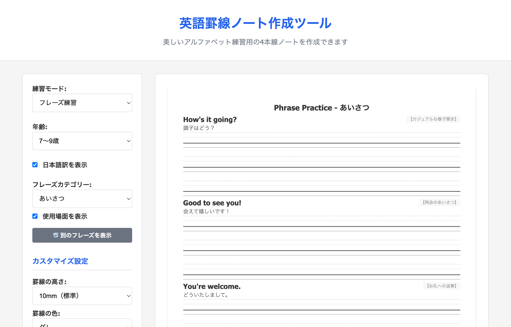

# 英語罫線ノート作成ツール

英語の4本線ノートをブラウザ上で作成・印刷できる静的Webアプリケーションです。インターナショナルスクールに通う子どもたちが実用的な語彙とフレーズを学べるよう、豊富なコンテンツと自動レイアウト機能を備えています。

## ライブデモとステータス

- ライブデモ: [https://knishioka.github.io/english-note-maker/](https://knishioka.github.io/english-note-maker/)
- 
- 


_フレーズ練習モード: 実用的な会話表現を4本線で練習_

## 主な機能

### 練習モード

1. **通常練習**: 基本的な罫線ノート（自由記述用）
2. **文章練習**: 年齢別の例文と練習行のセット
3. **単語練習**: カテゴリー別の単語と発音ガイド（音節表示付き）
4. **アルファベット練習**: 大文字・小文字の練習（2列レイアウト）
5. **フレーズ練習**: 実用的な会話表現と使用場面の表示

### 学習コンテンツ

- **単語カテゴリー（18種類）**: 基本（動物、食べ物、色、数字、曜日・月、学用品、身体、天気）、国際対応（教室の物、教科、スポーツ、感情〈上級〉、学習用語）、生活（学校施設、授業活動、国籍、国際料理、時間表現）
- **フレーズカテゴリー（16種類）**: 日常会話（あいさつ、自己紹介、学校生活、買い物、旅行、感情表現、日常生活）、学習支援（教室英語、友達作り、文化交流、緊急時の表現）、コミュニケーション（質問の仕方、チームワーク、問題解決、丁寧な表現、学習サポート）

### 年齢別の設計

- **4〜6歳**: 基本的で視覚的な語彙、簡単なフレーズ
- **7〜9歳**: 日常的な学校生活語彙、実用的な表現
- **10〜12歳**: 学術的・抽象的な語彙、複雑な文章表現

### カスタマイズ

- 罫線の高さ: 8mm（小さめ）、10mm（標準）、12mm（大きめ）
- 罫線の色: グレー、青、緑
- 表示オプション: 日本語訳、使用場面、名前・日付欄
- ページ数: 1〜5ページ

## インターナショナルスクール向けの工夫

### 実践的な内容

- 教室で実際に使う表現を厳選
- 文化交流や国際理解に役立つフレーズを収録
- 学習方法や問題解決のための表現を追加

### 段階的な学習設計

- 年齢に応じた語彙の難易度調整
- 基礎から応用まで体系的に学習可能
- 音節表示による発音練習サポート

### 4本線による正確な文字練習

- **上線**: 大文字の頂点（bやdの上部）
- **中線上**: 小文字の頂点（aやcの上部）
- **中線下**: ベースライン（文字の基準線）
- **下線**: 下降文字の底（gやyの下部）

## 使い方

### オンライン版

1. [デモサイト](https://knishioka.github.io/english-note-maker/)にアクセス
2. 練習モードとオプションを選択
3. 「印刷・PDF保存」ボタンをクリック

### 印刷の推奨設定

- 用紙サイズ: A4
- 印刷の向き: 縦
- 余白: なし（アプリ側で制御）
- 背景グラフィック: 有効（罫線表示に必要）

### 動的レイアウト調整

- 罫線の高さに応じてコンテンツ量を自動調整
- A4サイズに収まるよう最適化
- ページあふれを防止するバランス調整

## ローカル開発

```bash
# 依存関係のインストール
npm install

# 開発サーバー起動
npm run dev

# テスト実行
npm run test
```

## 技術的な特徴

- フロントエンド完結のSPAとして動作し、GitHub Pagesでホスティング
- 印刷時はCSSでA4向けに最適化し、オフライン利用も可能
- 自動レイアウト検証システムとCI/CDにより品質を担保

## プロジェクト構成

```
english-note-maker/
├── index.html           # メインページ
├── styles.css           # スタイルシート（印刷CSS含む）
├── script.js            # アプリケーションロジック
├── src/
│   └── quality-validator.js  # レイアウト品質検証
├── test/
│   ├── content-test.js  # コンテンツ整合性テスト
│   └── layout-test.js   # レイアウト妥当性テスト
├── .github/
│   └── workflows/
│       ├─ static.yml    # GitHub Pagesデプロイ
│       └── test.yml     # 自動テスト
└── docs/                # 詳細ドキュメント
```

## カスタマイズのヒント

### CSS変数

```css
:root {
  --line-height-mm: 10mm; /* 罫線の高さ */
  --line-spacing-mm: 2mm; /* 罫線間のスペース */
  --baseline-color: #d0d0d0; /* 罫線の色 */
}
```

### コンテンツの追加

`script.js`内の`WORD_LISTS`と`PHRASE_DATA`オブジェクトに新しいコンテンツを追加できます。

## コンテンツの規模

- 単語総数: 540語以上
- フレーズ総数: 380表現以上
- 対応年齢: 4〜12歳
- カテゴリー数: 単語18種類、フレーズ16種類

## 貢献ガイド

1. このリポジトリをフォーク
2. 機能ブランチを作成 (`git checkout -b feature/amazing-feature`)
3. 変更をコミット (`git commit -m 'Add amazing feature'`)
4. ブランチにプッシュ (`git push origin feature/amazing-feature`)
5. プルリクエストを作成

## ライセンス

MIT License - 詳細は[LICENSE](LICENSE)ファイルを参照してください。

## 謝辞

- 4本線レイアウトは伝統的な英語練習帳のデザインを参考にしています
- インターナショナルスクール向けコンテンツは教育現場のニーズを反映しています

## 開発支援

このプロジェクトは [Claude Code](https://claude.ai/code) を使用して開発されました。
